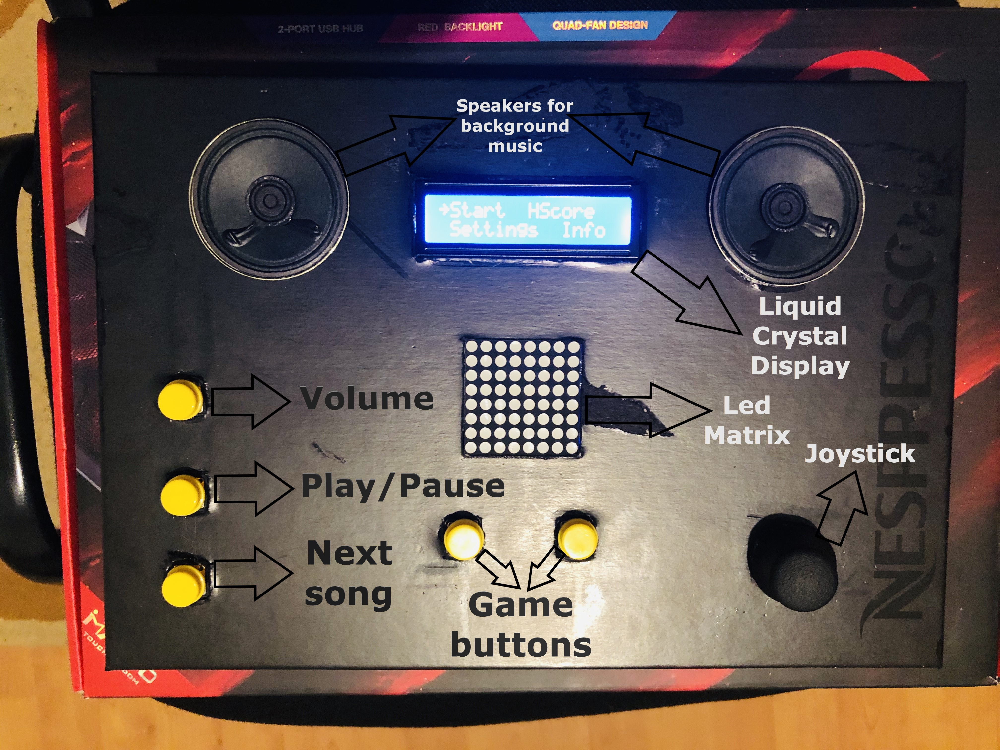

# Matrix Game  
### Name: Reverse It  
### Description:
**Reverse It** is an interactive single and multiplayer game where "instructions" are spawned on the screen and the player shall
have to reverse them shortly after they have appeared using a joystick in order to increase the score. For the beginning the game "instructions"
will be just random directed arrows (up,left,right,down,down-left,down-right) displayed on the led matrix. Every level will contain certain number
of arrows displayed (one after another). Reversing them corectly will increase score and after the player finishes the level 
the interval in which he has to execute the reverse move of pointing arrow will decrease.

### How to play: 
You have a joystick and 2 buttons below the led matrix. Random arrows pointing in 6 different positions will appear on screen. You have to do the reversed action of what arrow is telling you. For example if arrow is pointing down-left you have to press the right  button below the matrix, and so on.

### How the Game meets the requirements:
#### Hardware: 
I have all the compulsory hardware requirements and some speakers with background music.
#### Game Specifications: 
Score will be updated with every player move, and it will not be equal to level. Level will increase
after a certain number of correctly completed moves (10). The complexity (player move time) of the game increases with every level.
The player(s) will have 3 lives for each game played and every wrong move will decrease one life. There will be bonuses, if
the player completed the move in a certatin amount of time(very fast) will get back one life. Last 3 highscores will be saved
to eeprom with player names. I also have animations before starting the game.

#### LCD Display: 
LCD Display also have all the compulsory menus like play game, highscore(saved in eeprom), settings, 
where players can change their names; You can change the starting level and so on. There will be
also an info menu with all the informations about the game. After the game is finished a congratulate menu will appear and pressing the joystick button will get the player back to main menu.

### Video Link: https://www.youtube.com/watch?v=XB8CjM2mDLM&feature=youtu.be
